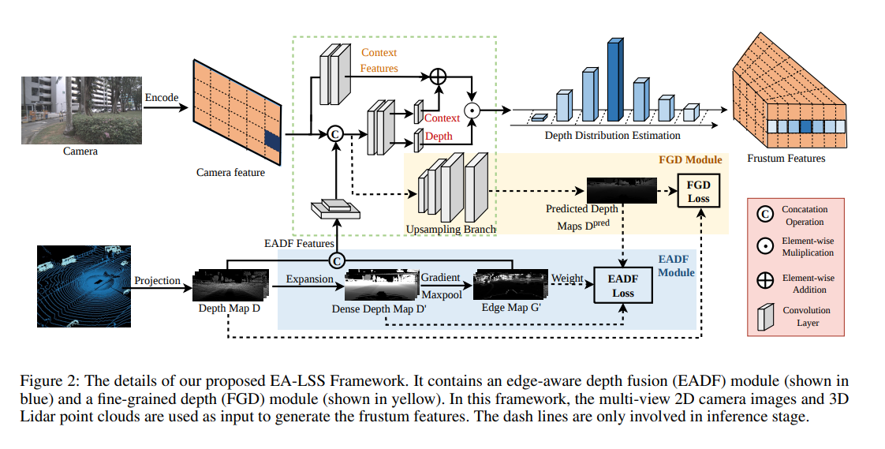
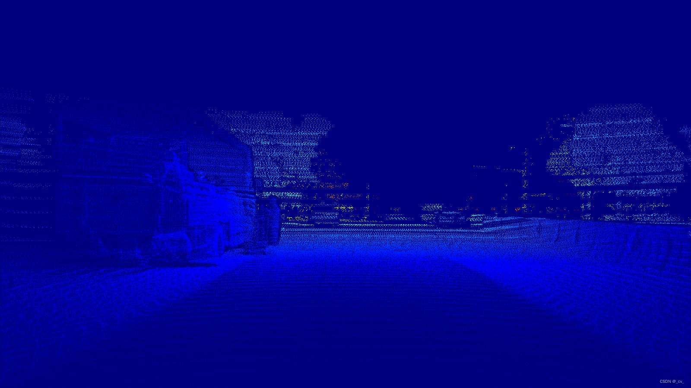
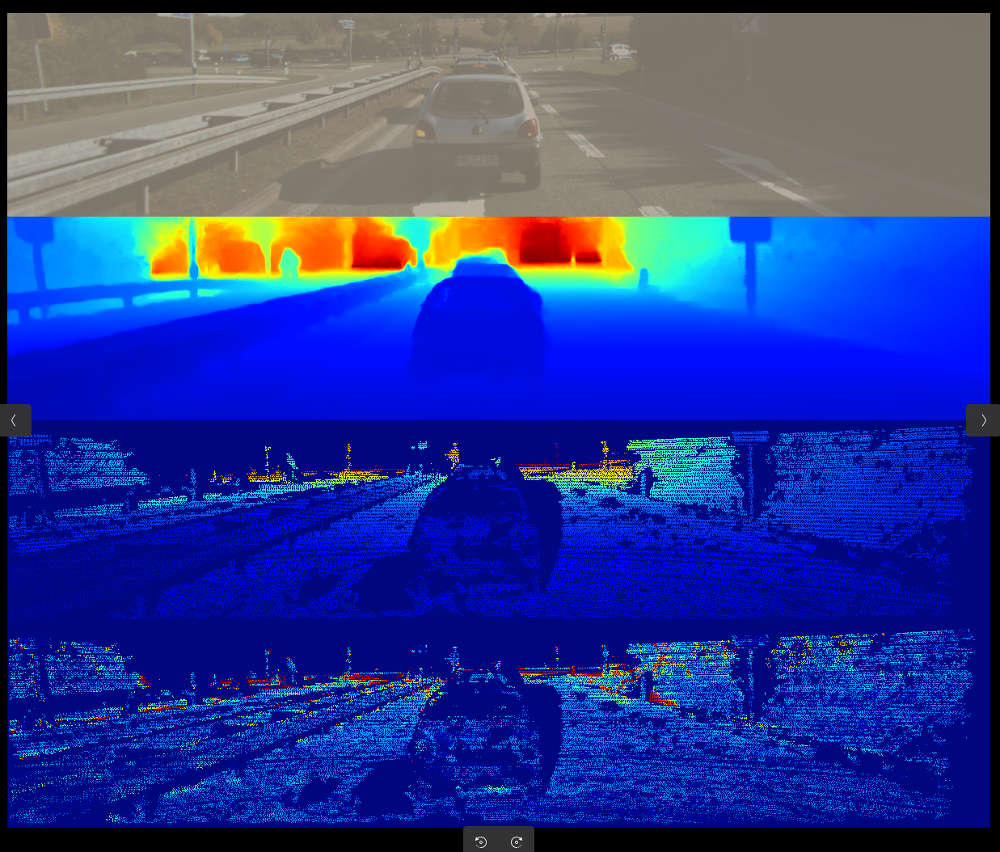
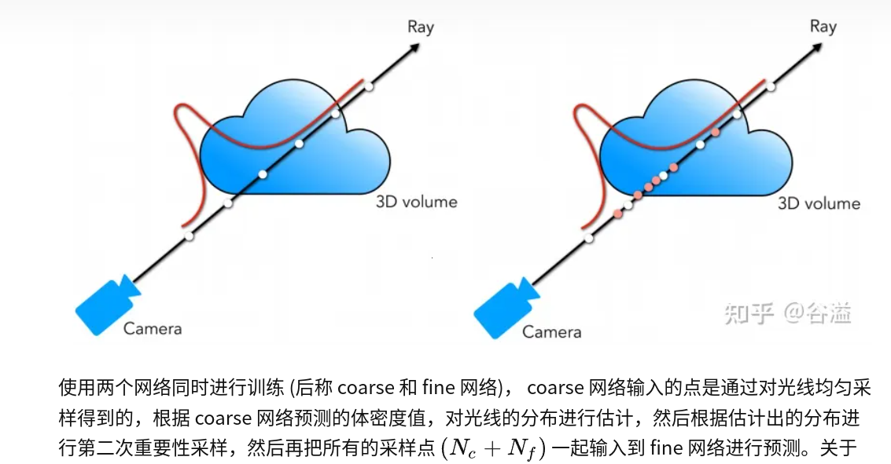
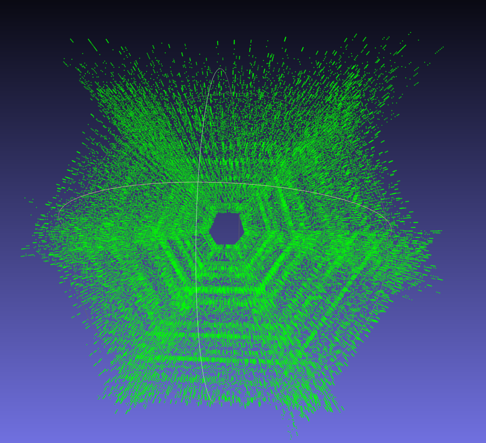
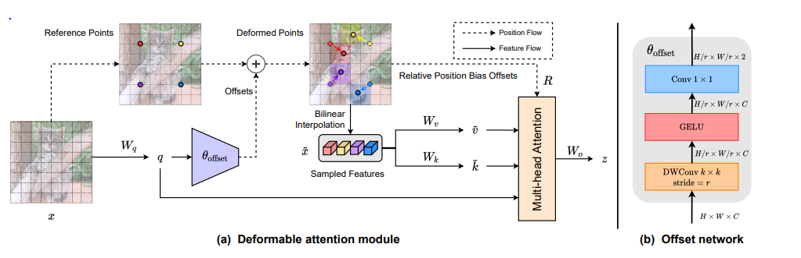
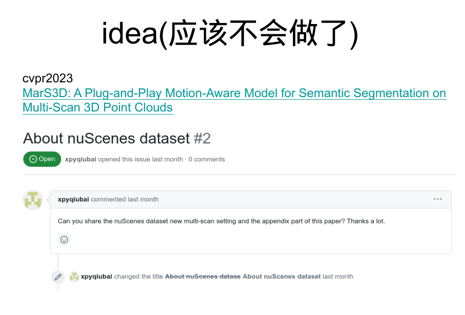

# lss_optimization
## 项目背景

这个项目是由于两年前刚毕业，加入公司没多长时间，领导也很open，我还属于自由探索阶段，本着出名要趁早的思想，想打榜nuscenes3d检测
选择LSS作为入手点，主要他是一个plug and play 的模型，对他的优化可以使得所有使用该模型的方法都涨点，所以就进行了一些实验

## 优化方向

1. 深度监督:nuscenes的深度真值比较稀疏
    是否可以用多帧雷达投影到一帧上给nuscenes造一个稠密的深度图?主要是给lss强的深度监督信号提升效果.

    又或者可以先训好一个深度补全的网络，然后利用这个网络生成的深度图作为lss的深度监督信号做一个二阶段的网络 .
    
2. lss深度采样：原始lss深度为固定间隔。
    
    受nerf启发,对lss深度采样(Depth-guided )，让深度不再是固定间隔
    

    同样是否可以采用offset network的方式来对图像梯度变化大的地方多采样(the guidance of pixel region )

# EA-LSS:
[ Edge-aware Lift-splat-shot Framework for 3D BEV Object Detection](https://arxiv.org/pdf/2303.17895)

# IDEA
从思路上来说，这篇工作是想通过更好的利用边缘深度监督来提升检测效果，因为雷达深度是稀疏的所以图像需要下采样，但这其实会导致深度跳变问题。我的思路是给更稠密的深度真值来做，同时使用深度引导和图像引导来提升检测效果，对于深度跳变问题其实也能cover了。他出发点是稀疏深度适配稀疏特征，但我是想用稠密深度来适配稠密特征，总之都是想让检测效果更好。


为此我做了一些事情，首先是稠密深度,单帧点云实在是太稀疏了，多帧累加起来效果会好很多

但是多帧累加需要解决动态场景的问题，不然就会有很多重影，对此我找到了[Dynamic 3D Scene Analysis by Point Cloud Accumulation](http://arxiv.org/abs/2207.12394)这篇工作，需要对nuscenes整个数据集跑一遍拿到稠密nuscenes点云图

获取到了稠密点云后面是否再加一个深度补全网络来做二阶段这也是需要测试的。

用补全深度还是稠密雷达深度可以验证一下。我发现深度补全网络似乎可以弥补稠密点云覆盖不到的情况。
我猜这也是为什么在后面的很多工作里会采用nerf渲染出来的深度去做监督而不是直接使用雷达真值去做。

深度真值说完就到网络部分了，首先是深度的固定间隔，一开始在考虑间隔时候我也尝试过其他分布方式。


<details>
  <summary>"UD"or"LID"or "SID"</summary>

  ```
  def bin_depths(depth_map, mode, depth_min, depth_max, num_bins, target=False):
        """
        Converts depth map into bin indices
        Args:
            depth_map [torch.Tensor(H, W)]: Depth Map
            mode [string]: Discretiziation mode (See https://arxiv.org/pdf/2005.13423.pdf for more details)
                UD: Uniform discretiziation
                LID: Linear increasing discretiziation
                SID: Spacing increasing discretiziation
            depth_min [float]: Minimum depth value
            depth_max [float]: Maximum depth value
            num_bins [int]: Number of depth bins
            target [bool]: Whether the depth bins indices will be used for a target tensor in loss comparison
        Returns:
            indices [torch.Tensor(H, W)]: Depth bin indices
        """
        if mode == "UD":
            bin_size = (depth_max - depth_min) / num_bins
            indices = ((depth_map - depth_min) / bin_size)
        elif mode == "LID":
            bin_size = 2 * (depth_max - depth_min) / (num_bins * (1 + num_bins))
            indices = -0.5 + 0.5 * torch.sqrt(1 + 8 * (depth_map - depth_min) / bin_size)
        elif mode == "SID":
            indices = num_bins * (torch.log(1 + depth_map) - math.log(1 + depth_min)) / \
                (math.log(1 + depth_max) - math.log(1 + depth_min))
        else:
            raise NotImplementedError
        if target:
            # Remove indicies outside of bounds
            mask = (indices < 0) | (indices > num_bins) | (~torch.isfinite(indices))
            indices[mask] = num_bins
            # Convert to integer
            indices = indices.type(torch.int64)
        return indices
```
</details>

当然后续还是遵照nerf使用了pdf采样

<details>
  <summary>code</summary>

  ```
if B == 1:
    BC_frustum = points.squeeze()[:,0,:,:].to("cpu")
else:
    BC_frustum = points.squeeze()[:,:,0,:,:].to("cpu")
new_xyz_frustum = BC_frustum.reshape(-1,3)
new_xyz_frustum[:,-1] = 1
weights_ = d.permute(0, 2, 3, 1).contiguous().view(-1, 4unsqueeze(2)
# new_xy_frustum = torch.cat((BC_frustum.reshape(-1,2).to("cpu"torch.zeros((BC_frustum.reshape(-1,2).shape)[0],1).to("cpu")dim=1)
# new_xyz_frustum = torch.cat((BC_frustum.reshape(-1,2).to("cpu"torch.ones((BC_frustum.reshape(-1,2).shape)[0],1).to("cpu")dim=1)
# BC_frustum = new_xyz_frustum.view(1,8,22,3).to("cuda:0")post_trans.view(4, 6, 1, 1, 1, 3)     
ray_bundle = RayBundle(
            origins=torch.zeros(new_xyz_frustum.shape),
            directions=new_xyz_frustum,
            pixel_area=torch.ones([1, 1]),
            nears=torch.ones([1, 1]) * 4,
            fars=torch.ones([1, 1]) * 45,
        ).to("cpu")
uniform_sampler = ray_samplers.UniformSampler(num_samples=4train_stratified=True).to("cpu")
if B == 1:
    train_stratified_=False
else:
    train_stratified_=False
pdf_sampler = ray_samplers.PDFSampler(num_samples=4train_stratified=train_stratified_, include_original=False)("cpu")
coarse_ray_samples = uniform_sampler(ray_bundle).to("cpu")
# self.frustum = coarse_ray_samples.view([4, 6, 41, 8, 22, 3])
samples = pdf_sampler.generate_ray_samples(ray_bundlcoarse_ray_samples, weights_.to("cpu"), 41)
# samples.frustums.starts = samples.frustums.starts[:,random.sam(range(samples.frustums.starts.size(1)), 41),:]
points[:,:,:,:,:,-1,0] = samples.frustums.starts.reshape(B,N,8,41).permute(0, 1, 4, 2, 3)
```
</details>
   

这样出来的frustum就不再是我们常见的那种很规则的了


 
    
再一个就是图像梯度变化大的地方多采样(the guidance of pixel region )，其实这里和EA-LSS解决深度跳变就有异曲同工之妙了，都希望可以细化深度，我的稠密深度监督应该也没问题

<details>
  <summary>code</summary>

```
        self.conv_offset = nn.Sequential(
            nn.Conv2d(self.n_group_channels, self.n_group_channels, kk, stride, pad_size, groups=self.n_group_channels),
            LayerNormProxy(self.n_group_channels),
            nn.GELU(),
            nn.Conv2d(self.n_group_channels, 41, 1, 1, 0, bias=False)
        )
        self.conv_offsetxy = nn.Sequential(
            nn.Conv2d(64, 64, kk, stride, pad_size),
            LayerNormProxy(64),
            nn.GELU(),
            nn.Conv2d(64, 2, 1, 1, 0, bias=False)
        )

        if False:
            for m in self.conv_offset.parameters():
                m.requires_grad_(False)
def get_depth_feat(self, x):
        x = self.get_eff_depth(x) #out [24, 512, 8, 22]
        # IPython.embed()
        # Depth
        x = self.depthnet(x) #[24, 512, 8, 22] -> [24, 105, 8, 22]
        
        # q_off = einops.rearrange(x[:, self.D:(self.D + self.C)], '(b c) s h w -> b c s h w', c=6)
        offsetxy = self.conv_offsetxy(x[:, self.D:(self.D + self.C)])

        offset = self.conv_offset(x[:, :self.D]).contiguous()
        
        # x1 = x[:, :self.D].clone() +  offset
        
        depth = self.get_depth_dist(x[:, :self.D]) #[24,41,8,22]

        # # 找到第二维度（索引 1）中的最大值
        # max_value, max_index = depth.max(dim=1)

        # # 创建一个新的张量，其中最大值为 1，其他值为 0
        # new_tensor = torch.zeros_like(depth)
        # depth = new_tensor.scatter_(1, max_index.unsqueeze(1), 1)

        # sparsemax = Sparsemax(dim=1)
        # depth_sparse = sparsemax(x[:, :self.D])
        new_x = depth.unsqueeze(1) * x[:, self.D:(self.D + self.C)].unsqueeze(2)

        return (offsetxy,offset), new_x #depth [24, 41, 8, 22],new_xp [24, 64, 41, 8, 22]
```
</details>


后续针对nuscenes 多帧累加的点云数据也被人做出来了


# experience
刚开始的时候自己做了很多初期的验证，自己搞一搞和领导讲一讲，后面发现活越整越大，单做真值数据一项就需要占用大量时间，后面的网络训练试错也需要精力，然后我就找公司里面有没有其他同事有想法的，可以一起搞，游说了很多人大家表示支持但都不愿意一起做，一方面不是个正式项目，一方面对于工作久了的人来说打榜也没什么意义。 认为打榜的都是花拳绣腿落不了地，当时自己也比较执拗，idea缺乏打磨，只想搞出点东西来出名也没考虑这个东西搞完实际的价值有多大，初心不正所以路就走偏了。如果当时不执着于采用造数据的方式，换个想法做深度就好了。当然后面造数据也有人做了当时想做的工作拿了cvpr2023，叫MarS3D: A Plug-and-Play Motion-Aware Model for Semantic Segmentation on Multi-Scan 3D Point Clouds.其实想法没错造数据改模型，也看到了问题，但是没有做好。自己当时不够强，想做的事情太大，缺资源缺打磨，只有一颗躁动的心就去做，结果没有人家做的好做的精，失败是自然而然的。
后续看到了别人做出来的东西，也看到了自己想做的事情别人做的更好了，再去试错再去做已经没有什么时间了，后面就要做公司都项目了。公司给新人这么长时间去试错其实我很开心，不论成败都有收获。
